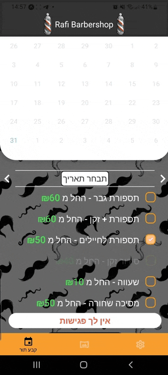

# Rafi-BarberShop-App react native

An application adapted for both ISO and Android, it is tested on both platforms, the app is used for managing and scheduling appointments at Rafi's barbershop. In addition, It contains contact via social media like WhatsApp, Instagram and Facebook.
, Registration and Login using firebase Authentication cloud Database.
In addition, animations are used, such as book appointments.
I used NAVIGATION STACK AND TAB technologies to switch between screens.
For data transfer I used REDUX which stores the user information and the appointment he selected.

# register screen

# login screen

# login successful
the user is on the firebase cloud 
 

# home screen

# home booking

# final-booking

# gallery screen

# gallery settings

